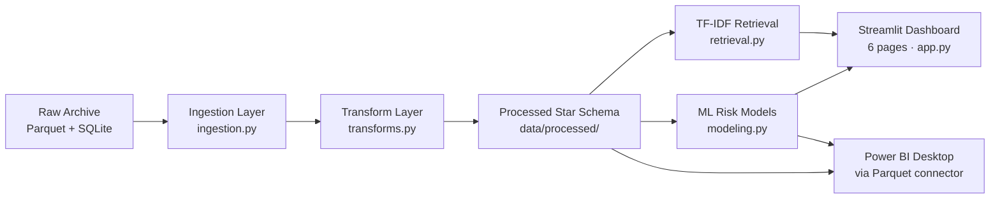

# Archive Enterprise Analytics

> End-to-end analytics platform: Customer 360, calibrated ML risk scoring, and an evidence-based retrieval assistant surfaced in a six-page Streamlit dashboard with a companion Power BI data model.


---

## Business Problem

Order operations generate a continuous stream of emails, documents, and events that are never unified. The result is delayed complaints surfacing too late, credit memos that could have been prevented, and reactive customer service driven by gut feel rather than data.

This platform unifies the archive dataset (raw parquet and SQLite) into a clean star schema, trains calibrated risk models to predict delays, complaints, and credit memos **before** they occur, and surfaces everything in an interactive dashboard that analysts can query in plain English.

---

## Capabilities

| Capability | Description |
|------------|-------------|
| **Data Pipeline** | Parquet + SQLite → vectorised fact / dimension star schema in one `build` command |
| **Risk Scoring** | Calibrated HGBC + Logistic Regression for delay, complaint, and credit-memo risk |
| **Retrieval Assistant** | TF-IDF with MMR diversity re-ranking and entity-level dedup: evidence, not hallucination |
| **Customer 360** | Per-customer issue rates, event timelines, and behavioral aggregates |
| **Quality Audit** | Automated data-quality report comparing raw vs. processed record completeness |
| **Power BI Model** | Ready-to-connect Parquet tables with DAX measures and theme (see `powerbi/`) |

---

## Architecture



Plain-English project guide: see `docs/PLAIN_ENGLISH_GUIDE.md`.

---

## Dashboard Pages

| # | Page | What it shows |
|---|------|---------------|
| 1 | **Executive Overview** | Top KPIs, monthly trend lines, customer–order Sankey, complaint heatmap |
| 2 | **Customer 360** | Per-customer issue rates, order history, behavioral scatter |
| 3 | **Order Timeline** | Unified event timeline across orders, emails, and documents |
| 4 | **Risk Scoring** | Calibrated delay / complaint / credit-memo probabilities, feature importance, model governance |
| 5 | **Evidence-Based Assistant** | TF-IDF retrieval Q&A with MMR diversity and entity dedup |
| 6 | **Data Quality** | Record-count and completeness audit across raw and processed tables |

---

## Risk Model Methodology

Three binary classifiers are trained per order using backward-looking features only (no leakage):

$$
\hat{y} \in \{\text{delay},\ \text{complaint},\ \text{credit memo}\}
$$

Each uses a **Histogram Gradient Boosting Classifier** calibrated with `CalibratedClassifierCV` (isotonic regression, 5-fold). A threshold $\tau$ is chosen to maximise $F_1$ on the hold-out set:

$$
\tau^* = \underset{\tau}{\arg\max}\ F_1(\tau) = \underset{\tau}{\arg\max}\ \frac{2 \cdot \text{Precision}(\tau) \cdot \text{Recall}(\tau)}{\text{Precision}(\tau) + \text{Recall}(\tau)}
$$

Key predictive features:

$$
\mathbf{x} = \bigl[\text{order line count},\ \log(\text{prior orders}),\ \text{prior delay rate},\ \text{prior complaint rate},\ \text{plant},\ \ldots\bigr]
$$

Calibration ensures the output $\hat{p} \in [0, 1]$ can be interpreted as a true probability, enabling threshold-based alerting and risk banding.

---

## Data Model

### Processed Tables (`data/processed/`)

| Table | Grain | Description |
|-------|-------|-------------|
| `fact_order` | 1 row / order | Order aggregations with boolean targets |
| `fact_order_risk_features` | 1 row / order | Backward-looking feature vector |
| `dim_customer` | 1 row / customer | Customer dimension with issue rates |
| `fact_email` | 1 row / email | Email enriched with scope, complaint, and spam flags |
| `fact_document` | 1 row / document | Business and supporting documents with financial splits |
| `fact_event_timeline` | 1 row / event | Unified cross-entity timeline |
| `fact_customer_daily` | 1 row / customer / day | Daily event aggregates |
| `retrieval_corpus` | 1 row / document | TF-IDF-ready text corpus |
| `data_quality_report` | JSON | Raw vs. processed completeness metrics |
| `build_manifest` | JSON | Build provenance (SHA-256 fingerprints, timestamps) |

### Model Artefacts (`data/models/`)

| File | Description |
|------|-------------|
| `*.joblib` | Trained + calibrated scikit-learn pipelines |
| `model_metrics.json` | CV metrics, thresholds, feature importance, run ID |
| `order_risk_scores.parquet` | Predicted probabilities and binary predictions per order |

---

## Streamlit Cloud Deployment

The dashboard is **not yet deployed on Streamlit Community Cloud**. The project is fully prepared for one-click deployment.

### Steps to deploy

1. **Fork or push** this repo to your GitHub account (already at `DavidMaco/Archive-Enterprise-Analytics`).
2. Go to [share.streamlit.io](https://share.streamlit.io) and click **New app**.
3. Set:
   - **Repository:** `DavidMaco/Archive-Enterprise-Analytics`
   - **Branch:** `main`
   - **Main file path:** `app.py`
4. Under **Advanced settings → Python version**, select **3.11**.
5. Under **Secrets**, add:
   ```toml
   ARCHIVE_ANALYTICS_RAW_DIR = "/mount/src/archive-enterprise-analytics/data/raw"
   ARCHIVE_ANALYTICS_ENABLE_UI_MUTATIONS = "false"
   ```
   > If you want the Build / Train buttons visible, set `ARCHIVE_ANALYTICS_ENABLE_UI_MUTATIONS = "true"` and ensure pre-seeded data is committed under `data/raw/`.
6. Click **Deploy**. Streamlit Cloud installs from `requirements.txt` and `pyproject.toml` automatically.

### Required files (all committed)

| File | Purpose |
|------|---------|
| `requirements.txt` | Flat pinned dependencies for Streamlit Cloud |
| `runtime.txt` | Python version (`python-3.11`) |
| `.streamlit/config.toml` | Dark theme + server hardening |
| `.streamlit/secrets.toml.example` | Template for operators |

---

## Power BI

A complete data model guide and DAX measure library lives in [`powerbi/README.md`](powerbi/README.md).

Quick connection path:
1. Run `python -m archive_analytics build` and `python -m archive_analytics train`.
2. In Power BI Desktop → **Get Data → Parquet** → point to `data/processed/` and `data/models/`.
3. Import the theme: **View → Themes → Browse** → select `powerbi/theme.json`.
4. Paste the DAX measures from `powerbi/README.md` into a Measures table.

Key relationships:

```
fact_order  ──(1:1)──  fact_order_risk_features
fact_order  ──(1:1)──  order_risk_scores
fact_order  ──(1:∞)──  fact_email
fact_order  ──(∞:1)──  dim_customer
```

---

## Quick Start (Local)

```bash
# 1. Clone and create a virtual environment
git clone https://github.com/DavidMaco/Archive-Enterprise-Analytics.git
cd Archive-Enterprise-Analytics
python -m venv .venv
.venv\Scripts\activate          # Windows
# source .venv/bin/activate     # macOS / Linux

# 2. Install with pinned dev dependencies
python -m pip install -c constraints-dev.txt -e ".[dev]"

# 3. Point to raw data (or use the project default data/raw/)
set ARCHIVE_ANALYTICS_RAW_DIR=C:\path\to\archive   # Windows
# export ARCHIVE_ANALYTICS_RAW_DIR=/path/to/archive  # macOS / Linux

# 4. Build processed data marts
python -m archive_analytics build

# 5. Train risk models
python -m archive_analytics train

# 6. Launch the dashboard
python -m archive_analytics serve
```

---

## Project Structure

```
archive-enterprise-analytics/
├── app.py                          # Streamlit home page + admin controls
├── pages/                          # Six dashboard pages (numbered sidebar)
│   ├── 1_Executive_Overview.py
│   ├── 2_Customer_360.py
│   ├── 3_Order_Timeline.py
│   ├── 4_Risk_Scoring.py
│   ├── 5_Assistant.py
│   └── 6_Data_Quality.py
├── src/archive_analytics/          # Installed Python package
│   ├── __init__.py                 # Public API re-exports
│   ├── __main__.py                 # CLI  (build / train / serve)
│   ├── constants.py                # Single source of truth for magic strings/numbers
│   ├── settings.py                 # Immutable AppConfig, env-based configuration
│   ├── ingestion.py                # Raw I/O: parquet + SQLite
│   ├── transforms.py               # Vectorised fact / dimension table builders
│   ├── quality.py                  # Data-quality audit report
│   ├── data.py                     # Build + load façade; readiness checks
│   ├── modeling.py                 # CV, calibration, threshold tuning, artefact I/O
│   ├── retrieval.py                # TF-IDF, MMR re-ranking, entity dedup
│   └── dashboard.py                # Streamlit caching, safe_page_section, asset gating
├── powerbi/                        # Power BI data model guide + DAX measures + theme
├── tests/                          # 38 pytest tests (0 database required)
├── .streamlit/                     # Streamlit Cloud config + secrets template
├── .github/workflows/ci.yml        # CI: Ruff · mypy · pytest · CLI smoke
├── constraints.txt                 # Pinned runtime deps
├── constraints-dev.txt             # Pinned dev deps
├── requirements.txt                # Flat deps for Streamlit Cloud
└── runtime.txt                     # Python version for Streamlit Cloud
```

---

## Development

```bash
# Tests
python -m pytest tests/ -v

# Coverage
python -m pytest tests/ --cov=archive_analytics --cov-report=term-missing

# Lint
ruff check src/ tests/

# Type-check
mypy --no-incremental src/archive_analytics/

# Full CI check (matches GitHub Actions)
ruff check . && mypy --no-incremental src/archive_analytics && pytest -q
```

---

## Operational Model

The dashboard is **read-only by default**. It never triggers a build or model training on page load.

| Action | How to invoke |
|--------|---------------|
| Build processed tables | `python -m archive_analytics build` |
| Train risk models | `python -m archive_analytics train` |
| Launch dashboard | `python -m archive_analytics serve` |
| Enable admin UI buttons | Set `ARCHIVE_ANALYTICS_ENABLE_UI_MUTATIONS=true` |

---

## Configuration

| Environment Variable | Default | Description |
|----------------------|---------|-------------|
| `ARCHIVE_ANALYTICS_RAW_DIR` | `data/raw/` | Path to raw archive parquet + SQLite files |
| `ARCHIVE_ANALYTICS_ENABLE_UI_MUTATIONS` | `false` | Enable Build / Train buttons in the UI |

---

## Design Notes

- **No `sys.path` hacks**: all imports use the installed package namespace.
- **Vectorised transforms**: `DataFrame.apply(axis=1)` replaced with `str.extract`, `np.select`, and vectorised SHA-1 hashing.
- **Error boundaries**: every page section is wrapped in `safe_page_section()` so one failing chart never crashes the page.
- **Calibrated probabilities**: `CalibratedClassifierCV` ensures $\hat{p}$ values are reliable for threshold-based alerting.
- **Honest retrieval**: the assistant returns ranked evidence with citations, not a generative summary.
- **Immutable config**: `AppConfig` is a frozen dataclass; output directories are created lazily.
